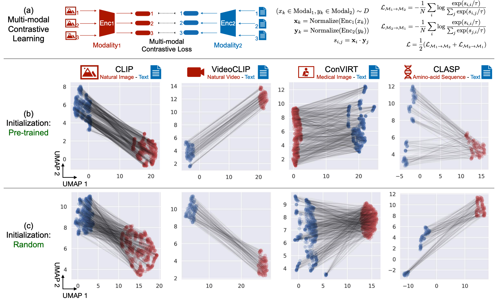
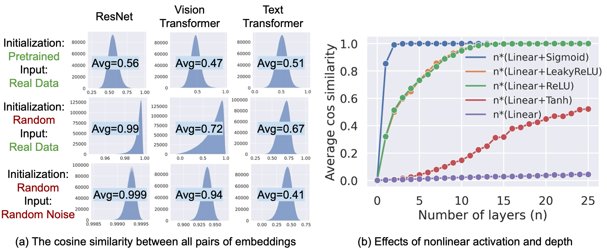
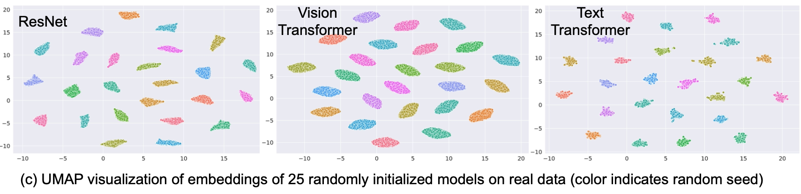
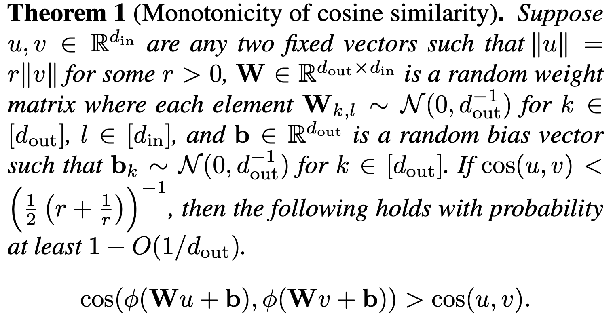
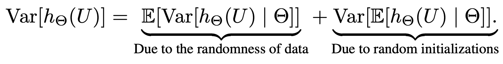
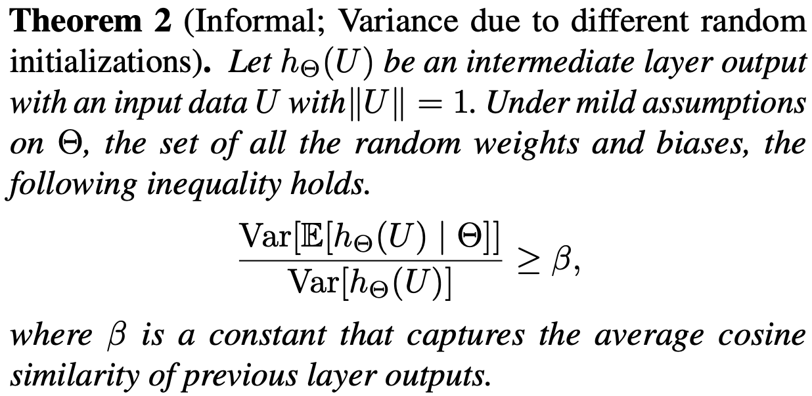
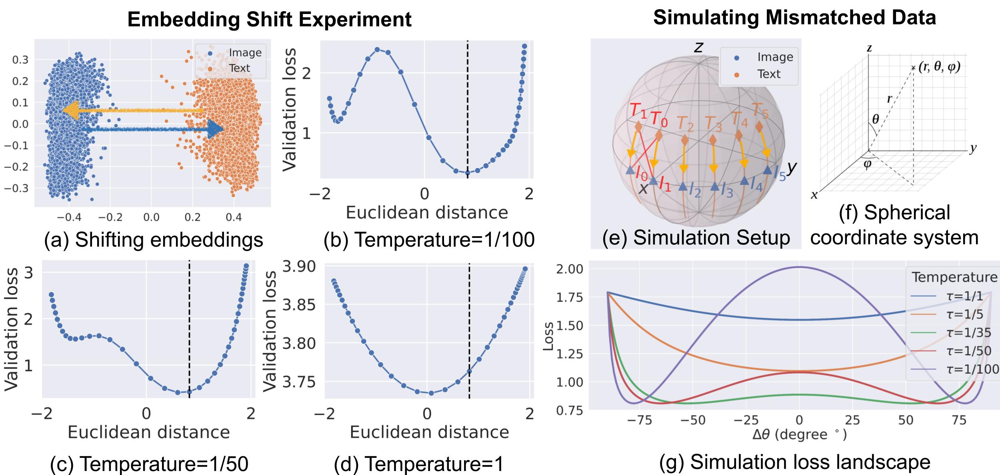
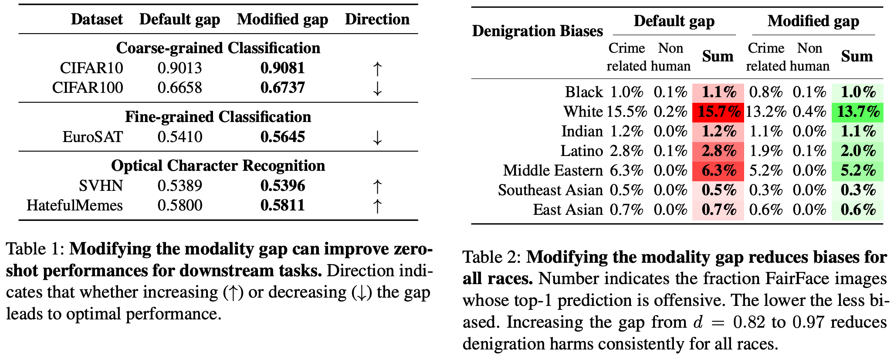

# Mind the Gap: Understanding the Modality Gap in Multi-modal Contrastive Representation Learning

[](https://modalitygap.readthedocs.io)
[](http://modalitygap.readthedocs.io/?badge=latest)
[](https://lbesson.mit-license.org/)
[](https://openreview.net/forum?id=S7Evzt9uit3)
[](https://www.python.org/downloads/release/python-360/)
[](https://shields.io/)
[](https://jupyter.org/try)


This repo provides the PyTorch source code of our paper: 
> [Mind the Gap: Understanding the Modality Gap in Multi-modal Contrastive Representation Learning](https://openreview.net/forum?id=S7Evzt9uit3) <br>
> Weixin Liang*, Yuhui Zhang*, Yongchan Kwon*, Serena Yeung, James Zou <br> 
> NeurIPS (2022) <br>
> [[PDF]](https://openreview.net/pdf?id=S7Evzt9uit3) 
[[Website]](https://modalitygap.readthedocs.io/) 
[[Twitter]](https://twitter.com/james_y_zou/status/1503370841957933056) 


## Repo Structure Overview
```plain
.
├── README.md
├── Figure_1_Modality_Gap/
├── Figure_2_Cone_Effect/
├── Figure_3_Contrastive_Learning/
├── Table_1_Implications_CLIP_Zero_Shot/
├── Table_2_Implications_CLIP_Fairness/
├── util/
```
We organize the code in the orders of the figures as presented in the paper. As the folder name indicated, 
the `Figure_1_Modality_Gap` folder provides the code for reproducing Figure 1. 


## Abstract
*We present modality gap, an intriguing geometric phenomenon of the representation space of multi-modal models. Specifically, we show that different data modalities (e.g. images and text) are embedded at arm's length in their shared representation in multi-modal models such as CLIP. Our systematic analysis demonstrates that this gap is caused by a combination of model initialization and contrastive learning optimization. In model initialization, we show empirically and theoretically that the representation of a common deep neural network is restricted to a narrow cone. As a consequence, in a multi-modal model with two encoders, the representations of the two modalities are clearly apart when the model is initialized. During optimization,  contrastive learning keeps the different modalities separate by a certain distance, which is influenced by the temperature parameter in the loss function. Our experiments further demonstrate that varying the modality gap distance has a significant impact in improving the model's downstream zero-shot classification performance and fairness.*

**TL;DR:** We present modality gap, an intriguing geometric phenomenon of the representation space of multi-modal models. 

## What is `Modality Gap`?


As shown in Figure 1 (b), 
CLIP's image embeddings and text embeddings are located in two *completely separate* regions of the embedding space. 
We find this phenomenon consistently across various multi-modal models, covering texts, natural images, videos, medical images, and amino-acid sequences. 
Interestingly, this phenomenon still holds even when we embed using multi-modal models with random weights (Figure 1 (c)). 


**Figure 1: The pervasive modality gap in multi-modal contrastive representation learning**


## How do we explain `Modality Gap`? A three-part explanationn. 

While it might seem reasonable to attribute the gap to differences in data distributions or to the different encoder architectures, we showed that these factors are *not* the fundamental cause of the modality gap phenomenon. This paper provides a *three-part explanation* for the modality gap phenomenon. 

1. The general inductive bias of deep neural architecture creates a cone effect: The effective embedding space is restricted to a narrow cone for pre-trained models or models with random weights. 

2. Different random initializations create different embedding cones. Since a multi-modal model consists of two encoders, which create different cones at random initialization, this explains how the modality gap is present at initialization. 

3. The contrastive learning objective commonly used by multi-modal models preserves the gap. 


### Part 1: The `Cone Effect` Induces A Modality Gap


**Figure 2 (a,b): The Cone Effect Induces A Modality Gap.** 

#### The cosine similarity between all pairs of embeddings (last-layer feature)
We extract 5,000 embeddings from the final layer of ResNet, Vision Transformer, and Text Transformer respectively on MSCOCO Caption. 
We then compute the cosine similarity be- tween all possible pairs of the 5,000 embeddings within each model. 

The average cosine similarity is substantially larger than 0, indicating that the embedding space is a narrow cone. 
The cone effect also holds on randomly initialized models, and on random noise inputs. 


#### Effects of nonlinear activation and depth.
As shown in Figure 2 (b), MLPs without non-
linear activation shows little cone effect. However, with non-linearity, the average cosine similarity increases rapidly as the number of layers increases. These results indicate that the non-linear activation functions play a crucial role in the cone effect.


### Part 2: Different random initializations create different cones


**Figure 2 (c): Different random initializations create different cones.** 


We randomly initialized a model 25 times, and plotted its extracted embeddings on the same real data via UMAP visualization. We found that each random initialization forms a distinctively different cone.
Since a multi-modal model consists of two encoders, which creates different cones at random ini- tialization, this explains how the modality gap is present at initialization. 


### Theoretical Analysis: 
#### Part 1: The `Cone Effect` Induces A Modality Gap

<p align='center'>
  
</p>

**Theorem 1:**
Our theoretical analysis shows that under mild assumptions, each neural network layer shrinks the angle between any pair of embedding vectors with high probability, thereby creating more narrow cones in deeper architectures. Here $\phi$ is the ReLU activation function. 

#### Part 2: Different random initializations create different cones


<p align='center'>
  
  
</p>

**Theorem 2:**
We further prove that different random initializations of model weights result in different cones. 
More specifically, the variance of an intermediate output mostly come from the model’s random initialization.


### Part 3: `Contrastive learning` preserves modality gap


**Figure 3: Contrastive learning preserves modality gap.** 

We hypothesize that the contrastive learning objective encourages the existence of the modality gap. To testify this hypothesis, we manually shift CLIP's image embeddings and text embeddings towards closing the gap. 

We found that under CLIP's default temperature $\tau=\frac{1}{100}$, the default gap distance $\| \vec{\Delta}_\text{gap} \|=0.82$ actually achieves the global minimum, and shifting toward closing the gap  *increases* the contrastive loss. 

However, when the temperature increases (Figure 3 (c,d)), the repulsive structure and the local minimum gradually disappear, and closing the gap becomes more optimal. 

Together, these results show that contrastive learning keeps the different modalities separate by a certain distance, which is influenced by the temperature parameter in the loss function. 


### Modality Gap Implications

Interestingly, by simply modifying the modality gap's distance, we can improve CLIP's zero-shot performance (Table 1) and fairness (Table 2). 



**Modality Gap Implications: Experiment Results** 

#### Table 1: Zero-shot Performance
One of the most interesting capabilities for CLIP is its strong zero-shot transferability to a variety of downstream tasks without any supervision. 
We found that modifying the modality gap can improve zeroshot performances on multiple downstream tasks. 

#### Table 2: Fairness
We found that increasing the gap from $0.82$ to $0.97$ *reduces* denigration harms consistently for *all* races. 
Meanwhile, we only observe a minor $0.0008$ top-1 accuracy drop. 
It is encouraging that a simple gap offsetting approach can lead to a consistent bias reduction across all races on such a complex model (i.e., CLIP). 


## Citation
```
@inproceedings{
  ModalityGap,
  title={Mind the Gap: Understanding the Modality Gap in Multi-modal Contrastive Representation Learning},
  author    = {Weixin Liang and
               Yuhui Zhang and
               Yongchan Kwon and
               Serena Yeung and
               James Zou},
  booktitle={NeurIPS},
  year={2022},
  url={https://openreview.net/forum?id=S7Evzt9uit3}
}
```


